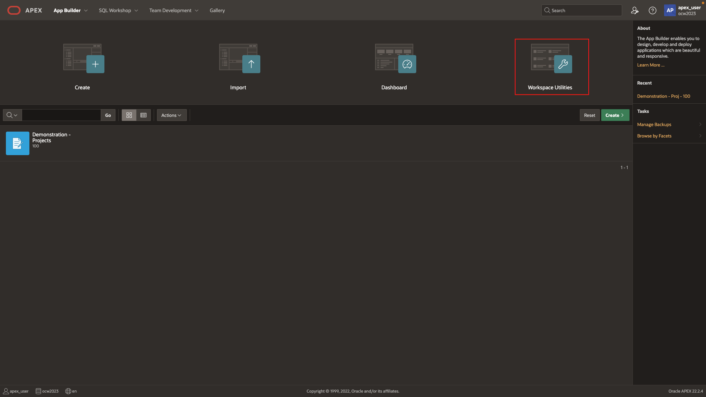
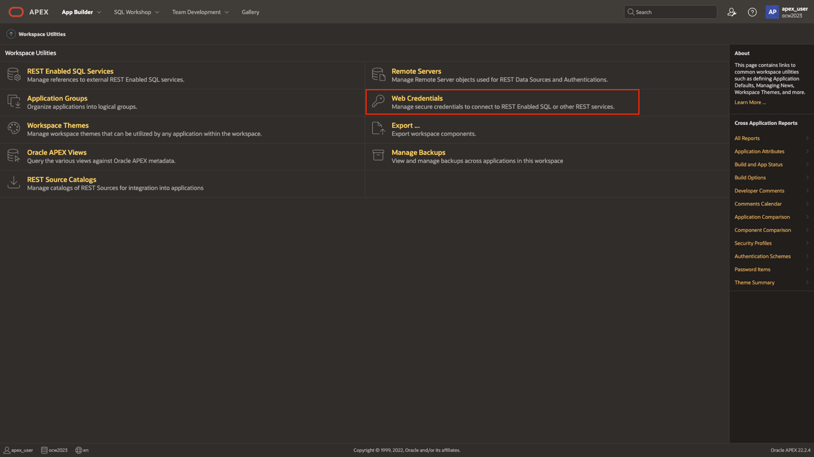
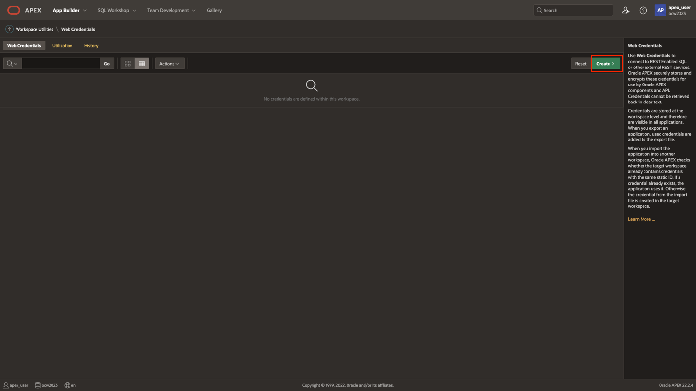
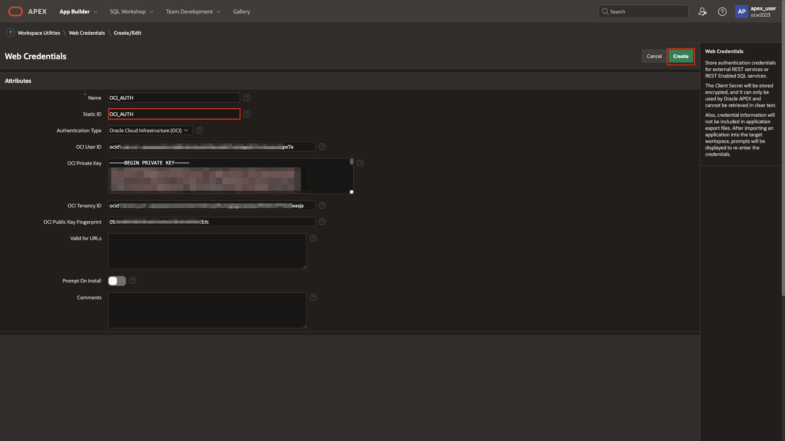
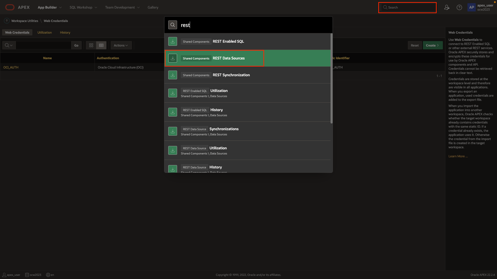
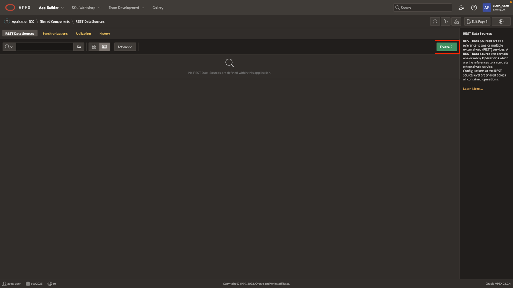
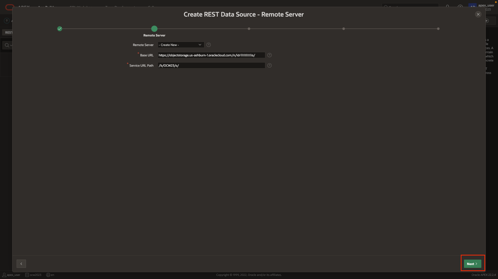
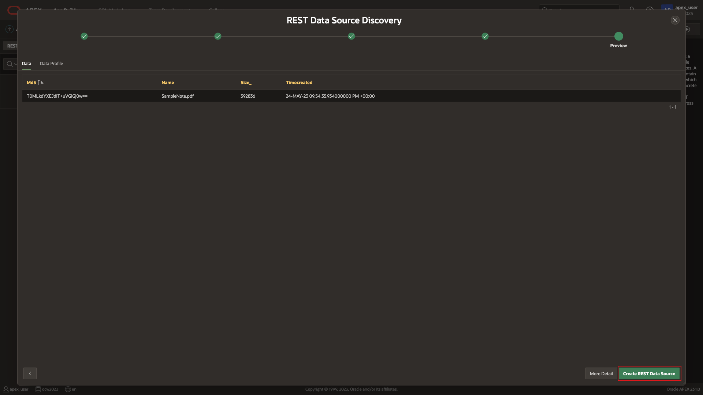
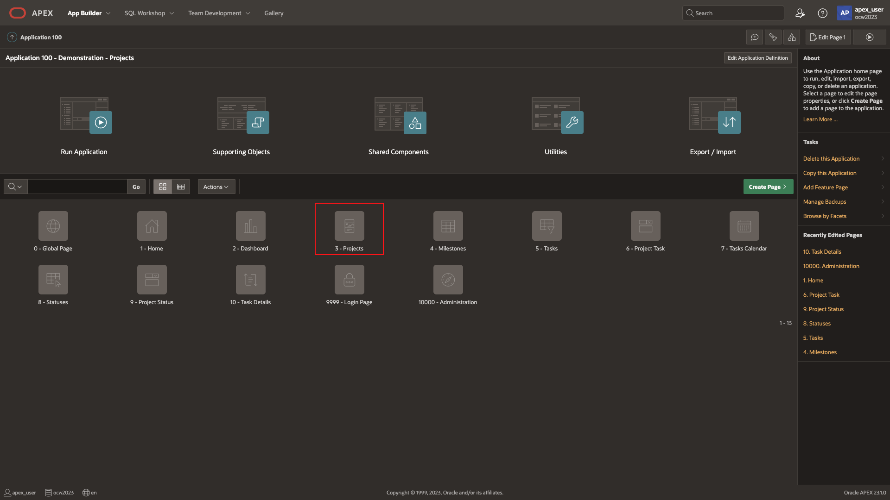
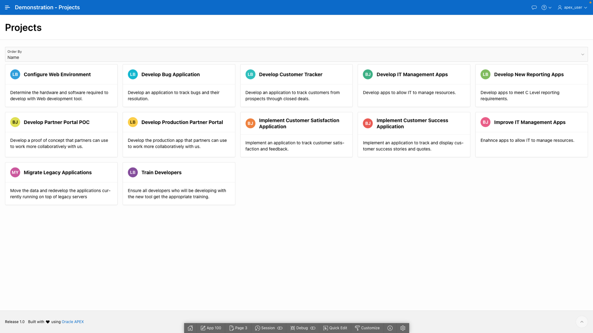

# Create REST data source

## Introduction

In this lab, you will create a REST data source

Estimated Time: 10 minutes

[Video Tutorial](youtube:XRwbswu0jEk)  **UPDATE FILE!**

### Objectives

In this lab, you will:

- Create Web Credentials
- Create REST data source

### Prerequisites

To complete this lab, you need to have the following:

- All previous labs successfully completed

## Task 1: Create Web Credentials

1. Navigate to workspace utilities. Click on Web Credentials and click create.

    

    

    

    

    

2. Create new OCI credentials with the information that was copied earlier from the OCI console. Apply changes.

    >**Note: In order to view the private key, open it with a code editor. If you do not have a code editor, change the extension from .pem to .txt and open it with a note pad and copy the contents**

    

## Task 2: Create REST Data Source

1. Use the search to navigate to create a new REST Data Source. It is also possible to navigate here via Shared Components

    

2. Create new REST Data Source from scratch

    

    

3. Set the REST Data Source type as OCI, give it an appropriate name, and enter your URL Endpoint. This URL endpoint will return a list of all object in the specified namespace and bucket name

    ```text
     <copy>
        https://objectstorage.us-ashburn-1.oraclecloud.com/n/{namespaceName}/b/{bucketName}/o/
     </copy>
    ```

    Similarly, for Phoenix region below.

    ```text
     <copy>
        https://objectstorage.us-phoenix-1.oraclecloud.com/n/{namespaceName}/b/{bucketName}/o/
     </copy>
    ```

    Here is the URL example endpoint for this environment

    ```text
     <copy>
        https://objectstorage.us-ashburn-1.oraclecloud.com/n/idrll......o/b/OCW23/o/
     </copy>
    ```

    >**Note:The URL endpoint will vary for each tenancy and each region. Please see documentation here for [Object Storage API](https://docs.oracle.com/en-us/iaas/api/#/en/objectstorage/20160918/Object/ListObjects)**

    

4. APEX will split the URL and create new remote server. Leave Base URL and Service URL Path as is.

    

5. Toggle the authentication on, and select the web credentials we created earlier, and choose **advanced**.

    

6. Click on **Advanced** to enter a query string variable as shown. Parameter name is 'fields'.
    Value:

    ```SQL
     <copy>
       name,size,timeCreated,md5
     </copy>
    ```

    

7. You should see the sample file that was uploaded directly from the OCI console earlier. We can now use this as a data source for our reports in an APEX page. Click **Create REST Data Source** to proceed.

    

8. Rest Data Source created! We can now use this rest data source in our new application. Click on Application 100 to return to the page overview.

    

9. Navigate back to the page overview. Click into page 3.

    

    

10. Before we proceed, let's have a quick refresher on the front-end UI. We will be adding an action button that redirects users to a modal dialog. In this dialog, users will be able to select their file and initiate the approval task.

    

You may now **proceed to the next lab**.

## Acknowledgements

- **Created By/Date** - Shayne Jayawardene, January 2023
- **Last Updated By/Date** - Shayne Jayawardene, July 2023
