# Create Form Page and Page Processing

## Introduction

You will get started by creating an autonomous database, collecting user and tenancy OCIDs, and creating a APEX workspace

Estimated Lab Time: 5 minutes

[Video Tutorial](youtube:XRwbswu0jEk)  ***UPDATE FILE!***

## Task 1: Create Form

1. Return to page 3 and create a new modal form page for our end users

    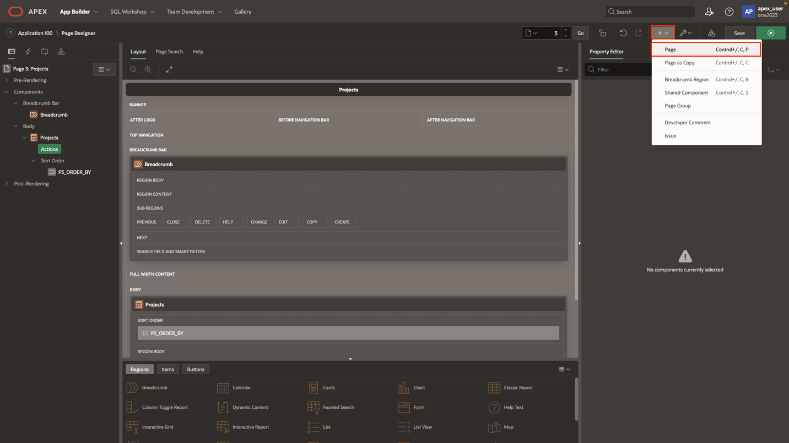

2. Select Form and enter the source details

    

    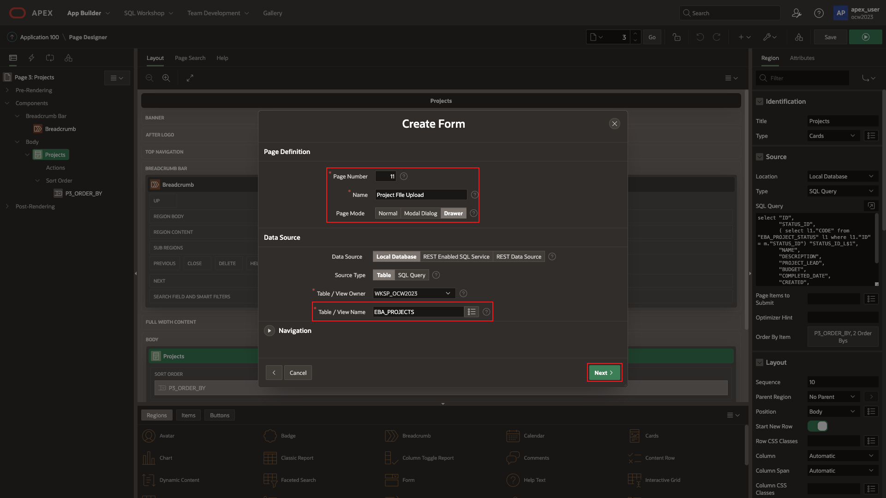

    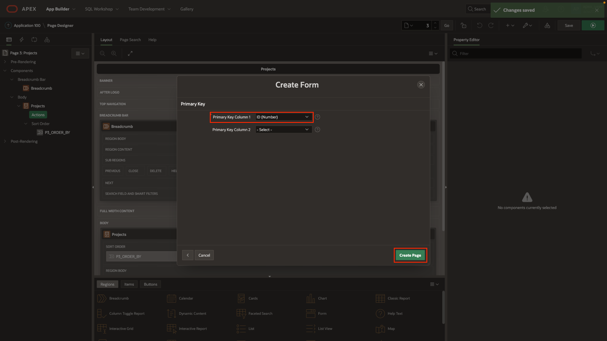

3. Page 11 is now created. Add two-page items to this page. A text field to hold our requestor's username, and a file browser to upload the local file.

    ***Note: If the page number does not default to 11, change it to 11.***

    

    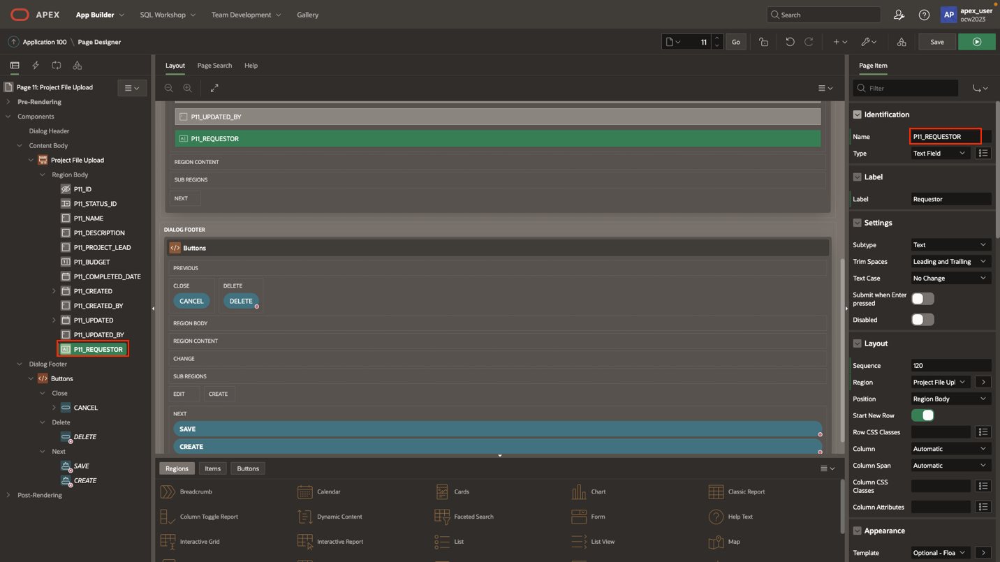

4. Add one more for the file upload

    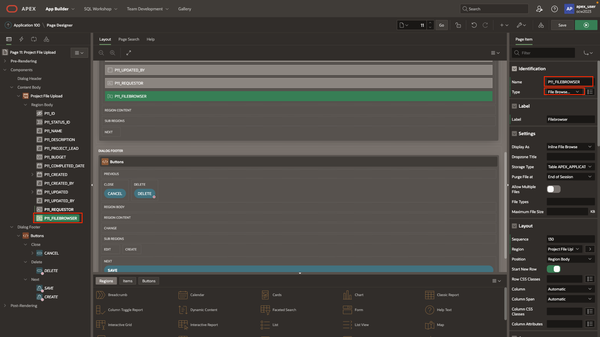

5. Save changes and return to page 3.

    

6. On page 3, create action as shown

    

    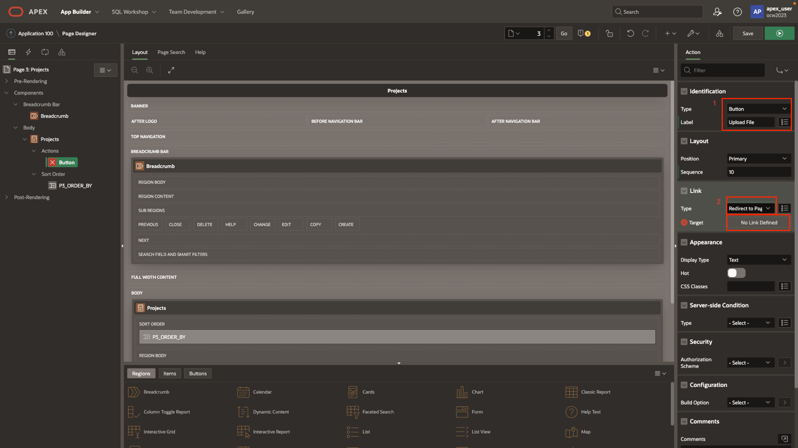

7. Set the details of the link as shown

    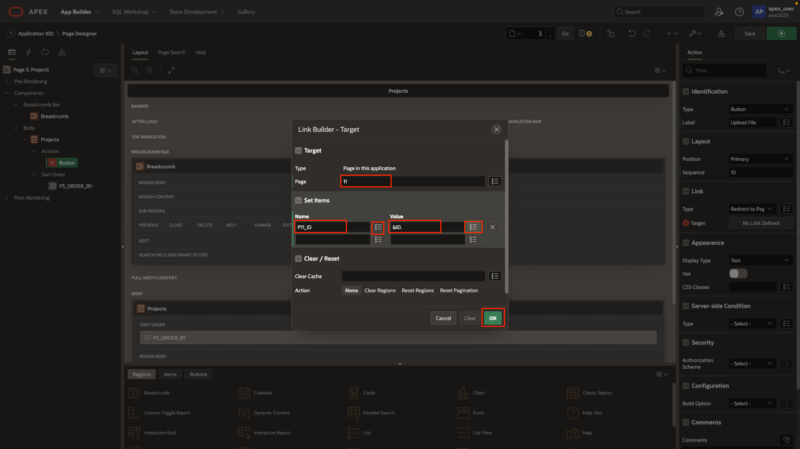

    

8. To verify if everything is functioning correctly, proceed to the user interface (UI) and click on any of the project upload file buttons. As a result, the form should automatically populate based on the primary key that was passed through the button link. To return to page 11, simply click here.

    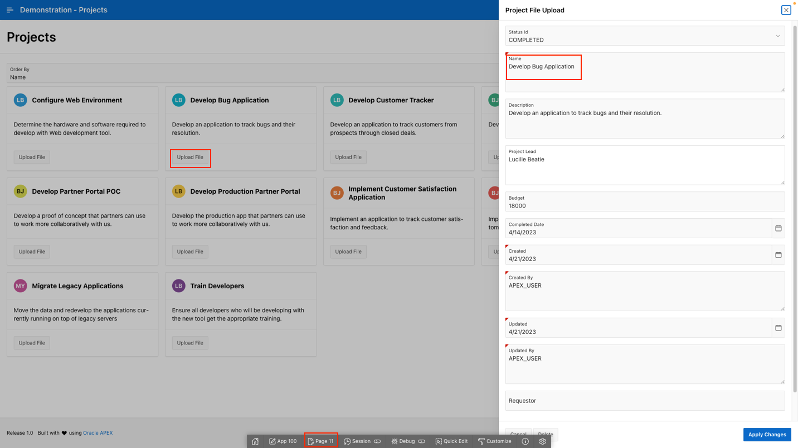

9. Return to Page 11

    

10. Hide all the page items we do not wish to display to our end users. You can multi-select and set type to hidden

    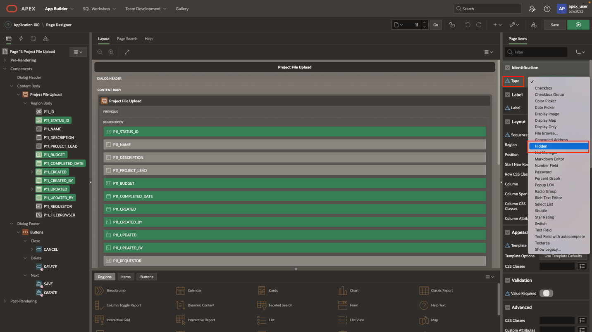

11. Default the requestor to the current logged in user

    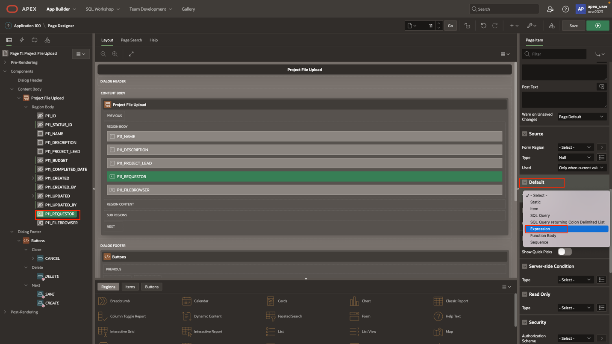

    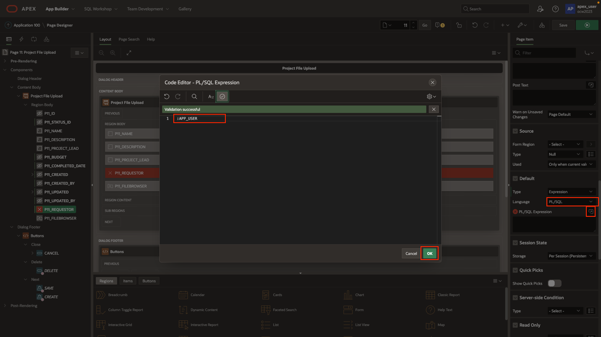

12. Save and run from page 3 or refresh the browser and check how the form looks now

    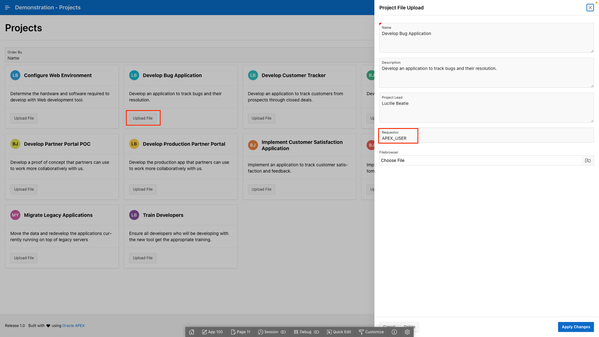

13. We can also change the text of the "Save" button from Apply Changes to "Submit"

    

14. Now, navigate to the **Process** section and create a new process. This process will initiate our task definition and generate a task specifically for the project lead of the selected project.

    

15. Fill in the details as shown and drag the new process between the two existing ones.

    ***Note: These processes will execute sequentially***

    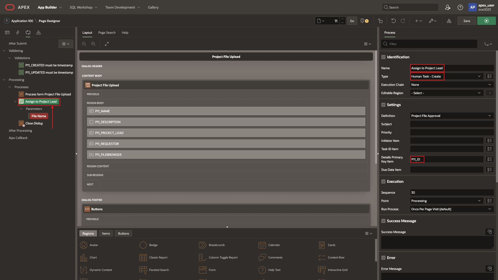

16. Finally set the parameter that was created earlier to hold the file name of the uploaded file.

    >***Note:*** Currently, testing is not possible as certain pages and sample users for the three project leads need to be set up in order to view the tasks.

    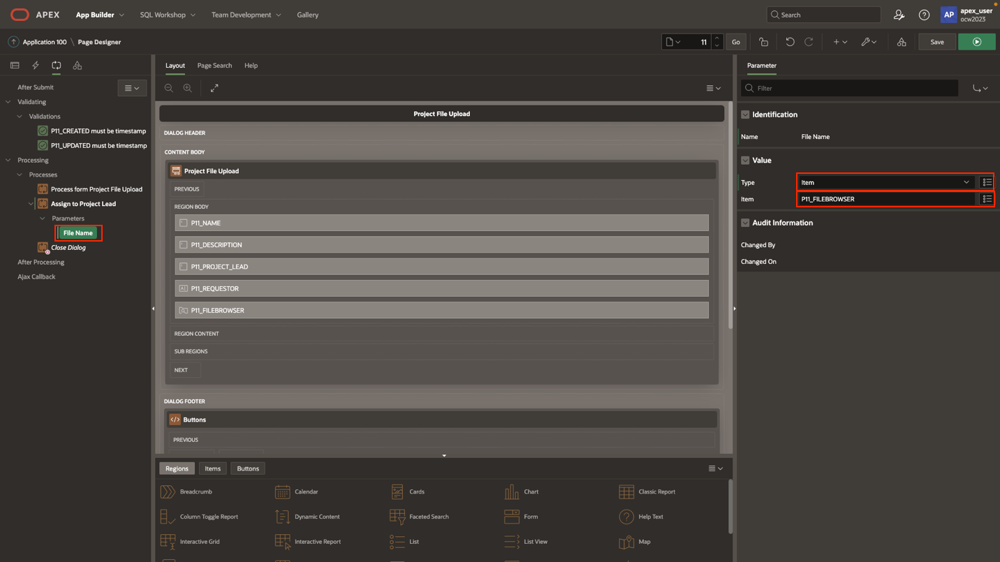

## Acknowledgements

- **Author** - Shayne Jayawardene
- **Last Updated By/Date** - Shayne Jayawardene, May 2023
