# Alter task details

## Introduction

In this lab, upload objects to Object Storage, and alter page details.

Estimated Time: 10 minutes

[Video Tutorial](youtube:XRwbswu0jEk)

### Objectives

In this lab, you will:

- Create an application definition
- Upload object to a bucket
- Alter task details page

### Prerequisites

To complete this lab, you need to have the following:

- All previous labs successfully completed

## Task 1: Task Details

1. In line 31 of the code, there is a substitution string called "G\_BASE\_URL". An application definition needs to be created for it. To accomplish this, navigate to the **Application Definition** section

    >**Note: Instead of hard coding the value, it is recommended to create a substitution variable for "G\_BASE\_URL" since it will be reused later. This will ensure easier management and flexibility.**

    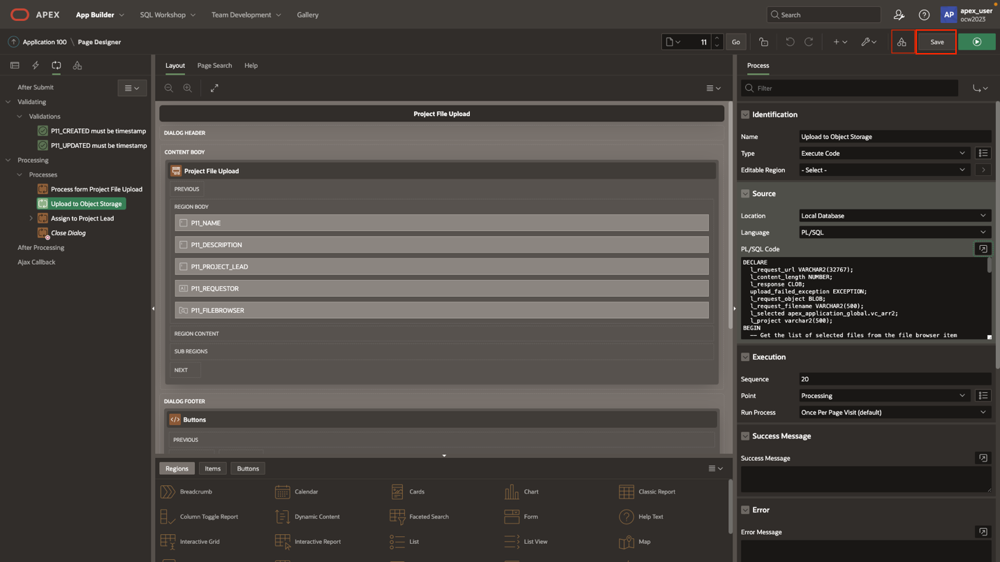

    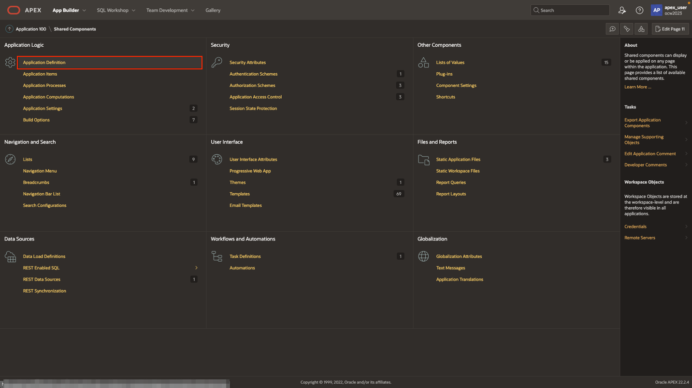

2. Add a static substitution string representing the base part of the object storage URL, including the tenancy namespace from earlier

    >**Note: The URL will follow this structure for Ashburn region: <https://objectstorage.us-ashburn-1.oraclecloud.com/n/{tenancy-name}>. Similarly, for Pheonix region: <https://objectstorage.us-pheonix-1.oraclecloud.com/n/{tenancy-name}>**

    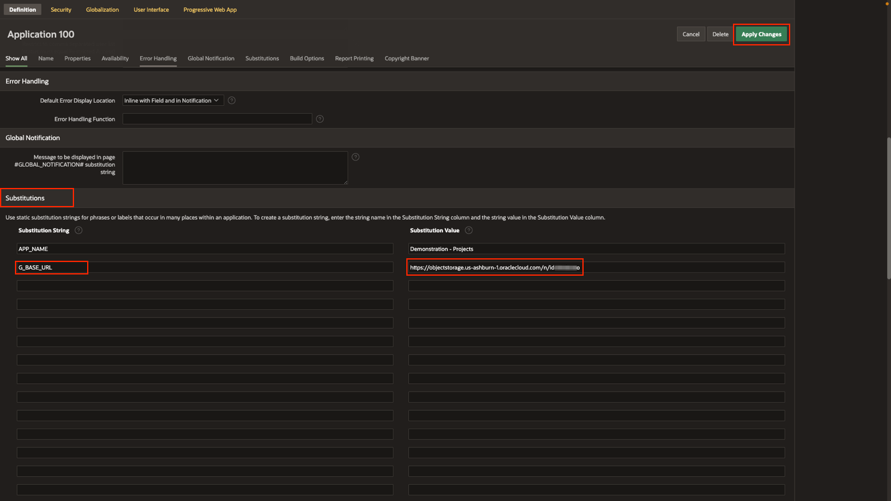

3. Please return to the runtime environment in the other tab to test the newly implemented upload process

    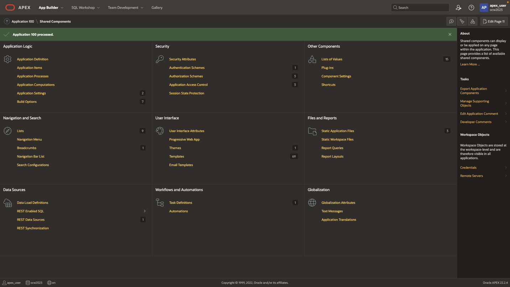

4. Choose to upload file to the first project (Configure Web Environment) and upload any local file

    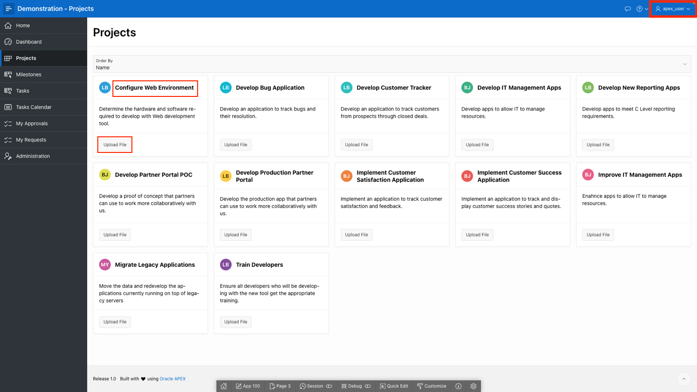

    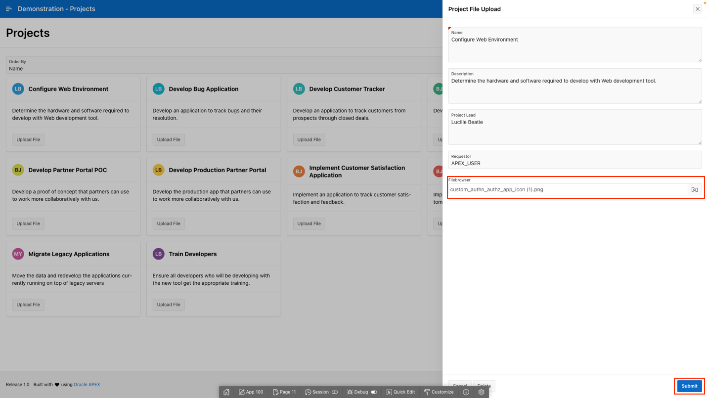

5. After completing this in the runtime environment, proceed to the OCI console to verify the uploaded file exists in the object storage bucket

    >**Note: In the code, the "project name + /" is added to the file name. This approach creates a folder for each project if it doesn't already exist. If the folder already exists, the object will be placed inside that folder.If you navigated away from the OCI console, follow the steps from before to access Object Storage buckets**

    

    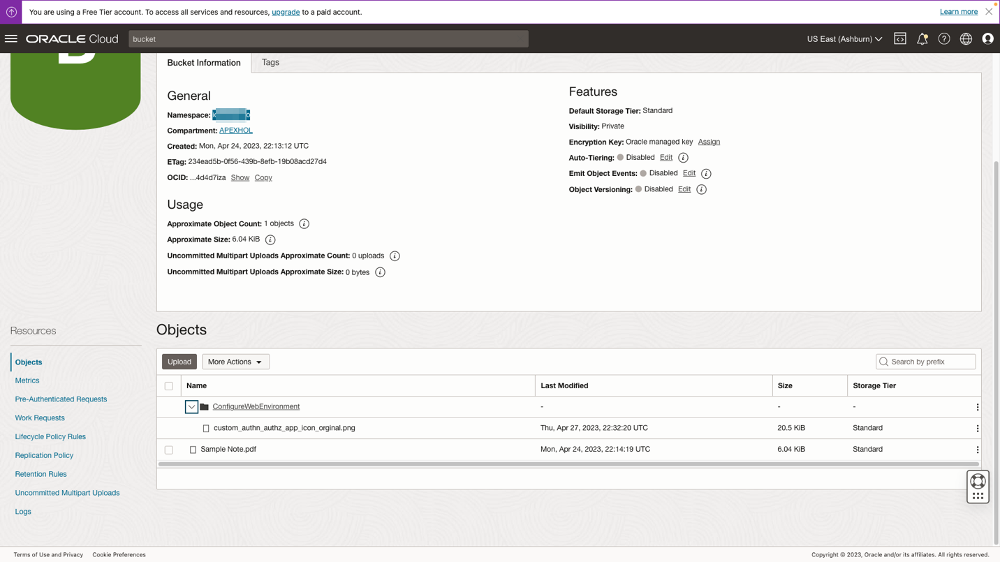

6. The next step is to focus on the task details page and enable the download functionality. To proceed, please return to page 10.

    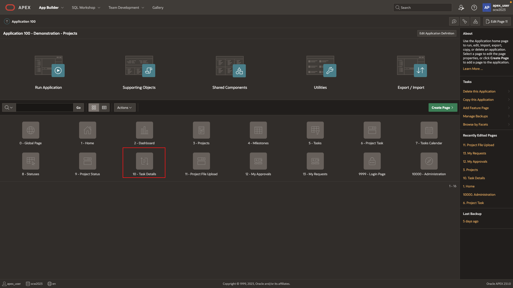

7. In the **Details** section, modifying the existing query slightly is an optional step that can enhance the end-user experience.

    ```SQL
     <copy>
        -- Retrieve param_label and a substring of param_value starting from the position after the first occurrence of '/'
        -- The function INSTR is used to find the position of the first '/' in param_value, and then SUBSTR is used to extract the substring starting from the next position.
        SELECT param_label,
        SUBSTR(param_value, INSTR(param_value, '/') + 1) -- Extract substring after '/'
        FROM apex_task_parameters
        WHERE task_id = :P10_TASK_ID -- Filter by the given task_id
        AND is_visible = 'Y';
     </copy>
    ```

    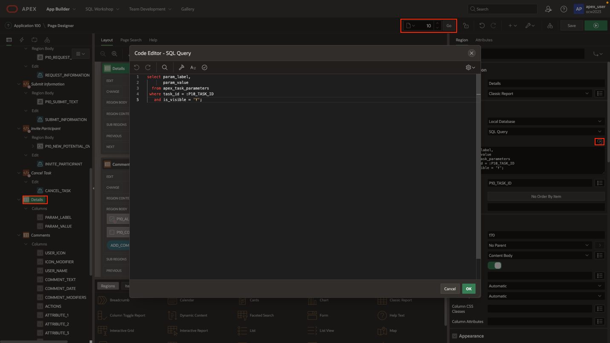

    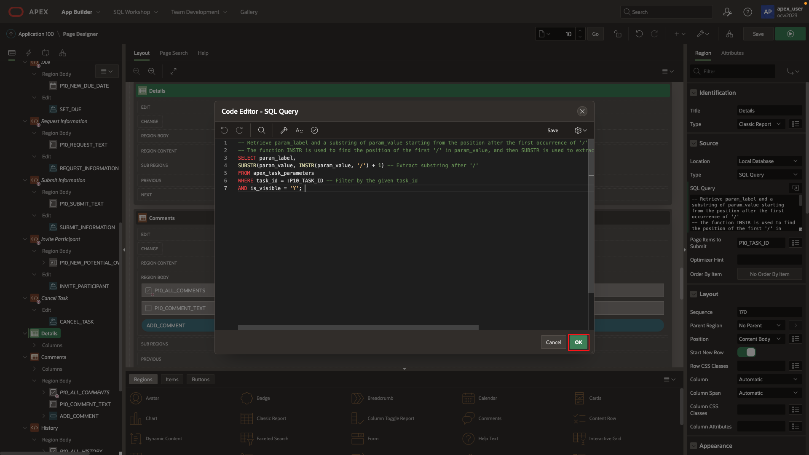

8. Next, a region below will be created specifically for viewing and downloading object storage files

    

9. Please input the details as displayed. Subsequently, a hidden page item will be created below to store the file name. This will ensure that only the file(s) with similar names to the uploaded task file will be displayed, rather than displaying all files.

    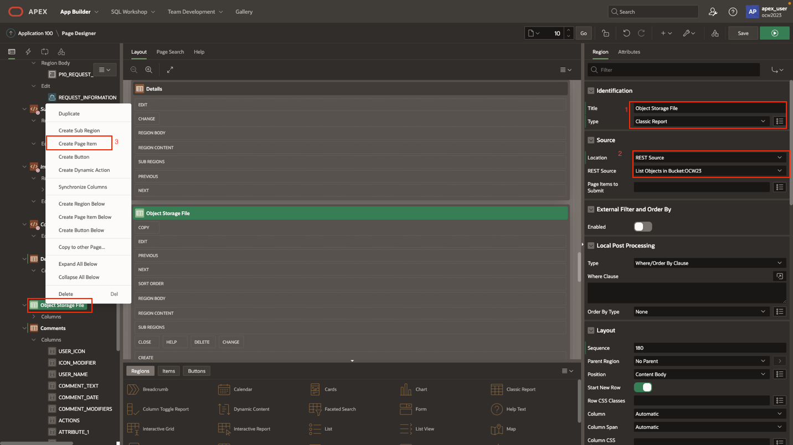

    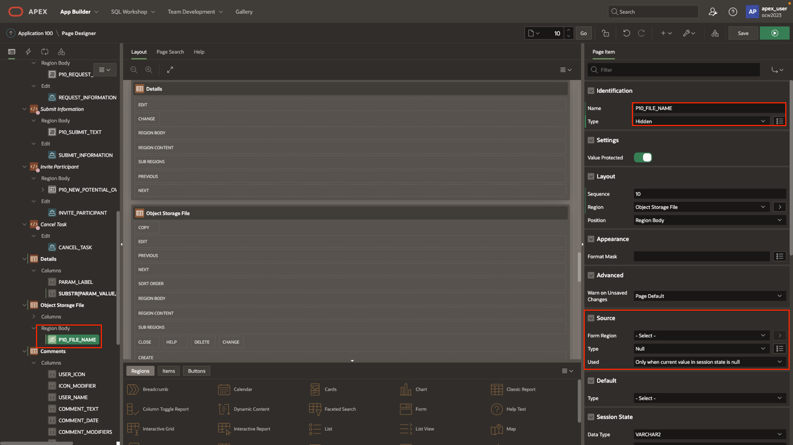

10. The source of this page item needs to be altered in the **Source** section. Please enter the query as shown below

    ```SQL
     <copy>
        -- Retrieve a modified version of param_value where the substring after the first occurrence of '/' is extracted and any spaces are replaced with underscores.
        SELECT
        REPLACE(SUBSTR(param_value, INSTR(param_value, '/') + 1), ' ', '_') -- Extract substring after '/' and replace spaces with underscores
        FROM apex_task_parameters
        WHERE task_id = :P10_TASK_ID -- Filter by the given task_id
        AND is_visible = 'Y';
     </copy>
    ```

    

11. Next, navigate back to the object store classic report that was just created and add a post-processing query.

    

     ```SQL
     <copy>
        select MD5,
        NAME,
        SIZE_,
        TIMECREATED
        from #APEX$SOURCE_DATA#
        where NAME LIKE '%'||:P10_FILE_NAME||'%'
     </copy>
    ```

    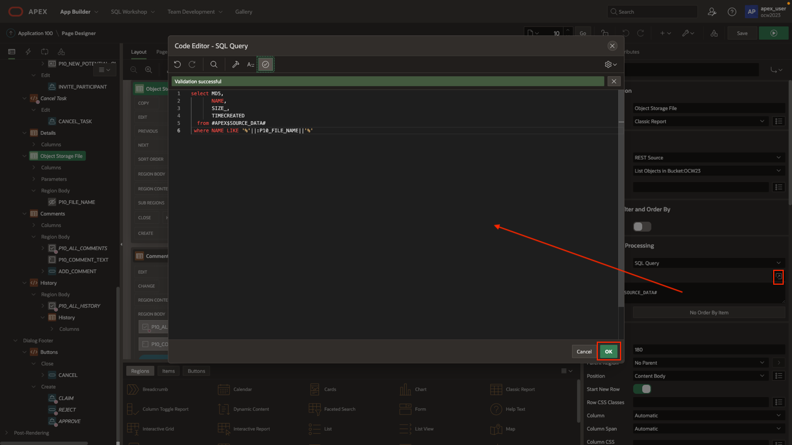

12. Save all the changes made so far, as it's now time to create a hidden page responsible for processing the download of the object storage file.S

    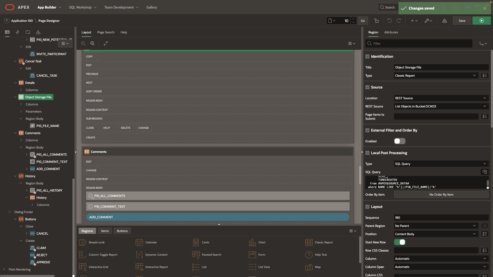

You may now **proceed to the next lab**.

## Acknowledgements

- **Created By/Date** - Shayne Jayawardene, January 2023
- **Last Updated By/Date** - Shayne Jayawardene, July 2023
